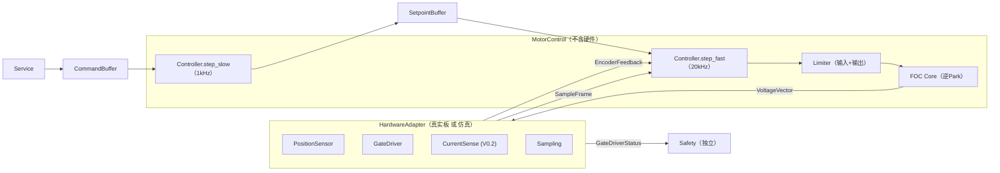
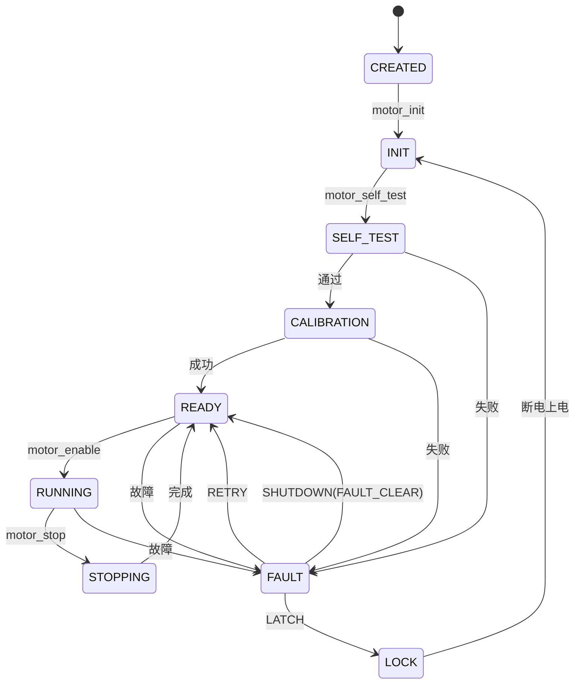

# Motor FOC Framework — 设计文档（工业 / 汽车级）V0.1.6 — Architecture Baseline（架构基线冻结）

> 一个**符合工业与汽车行业标准、跨 MCU、基于 RTOS** 的电机 FOC 框架。
> 定位：融合 **ODrive** 的架构严谨性（控制链 + 前馈、限幅、自动整定、安全）与 **SimpleFOC** 的简洁可读、易移植、快速上手，并遵循 **MISRA-C / AUTOSAR** 等工业汽车工程实践。
> **V0.1.6 是 Architecture Baseline（架构基线冻结）**：命名**不叫 V1.0**——核心架构虽已稳定，但**尚未经过真实硬件验证**。本版把最后一批**量产级闭环**（① 跨任务数据规则 Buffer/Snapshot/Event　② Fast Loop 约束　③ GateDriver 分级　④ 参数体系冻结　⑤ CommandLimitTable 按模式限幅　⑥ Feedback 唯一出口　⑦ FaultMonitor　⑧ TORQUE 延迟模型）全部写入规范并冻结。**冻结的是"架构规范与接口"，不是"所有功能"**。此后不再做结构性改动，转入实现阶段：**① STM32G4/H7 reference implementation（HAL + Board + Motor 实例打穿架构）② fake HAL + PC 单元测试 ③ 真实电机闭环**。

---

## 0. 版本与冻结状态

| 项 | 状态 |
|----|------|
| 版本 | **V0.1.6（Architecture Baseline / 架构基线冻结）** |
| 架构结论 | **冻结"架构规范与接口"，不是"所有功能"**；不再做结构性改动。**不叫 V1.0**——需真实硬件验证后才升级版本；剩余风险是**实现质量**，不是设计错误 |
| 冻结项 | ① 依赖 DAG　② HAL 原语（含 Safety 原语）　③ Device / HardwareAdapter 接口　④ 生命周期 + 校准插件 + 模式切换　⑤ 单位制 + 物理量 + **FOC 坐标系约定**　⑥ Service API　⑦ 执行流水线（多速率 fast/slow）　⑧ TimeBase + **TimeStep** + 采样链 + PWM 同步　⑨ 参数三分离 + MotorCapability + **参数体系冻结（唯一来源 `foc/config.h`）**　⑩ 实时/非实时数据分离（FastFeedback/EncoderFeedback/Telemetry + **FeedbackQuality**）　⑪ 独立 Safety 层 + Watchdog　⑫ 禁止事项　⑬ **跨任务数据规则（Buffer / Snapshot / Event）**　⑭ **Fast Loop 允许/禁止清单**　⑮ **GateDriver 分级（FastFault / SlowStatus）**　⑯ **FaultMonitor（debounce/hysteresis/retry/latch）**　⑰ **CommandLimitTable（按模式限幅）**　⑱ **TORQUE 延迟模型（≤1ms，无旁路）**　⑲ **Runtime Data Access Rule（运行数据访问铁律）**　⑳ **ConfigSnapshot 接入执行链（MotorRuntime 无 rcfg 指针）**　㉑ **V0.1 控制链语义（voltage_sp，禁 iq_sp）**　㉒ **Device/Driver 命名统一 + Board 边界（非 BSP）**　㉓ **Fault 边界（唯一出口 motor_enter_safe_state()）**　㉔ **启动初始化依赖顺序** |
| 明确不冻结 | 电流环细节、Controller 具体算法（PID/阻抗/…）、Sensor 型号、RTOS 实现、多轴同步细节、Observer（无真实实现不抽象）、V0.2 功能（CAN / 电流环 / 参数迁移细化 / DTC 细化 / RuntimeStats 细化） |

> **演进**：V0.1 … → V0.1.4（执行流水线）→ V0.1.5（多速率 + 系统级）→ **V0.1.6（本版，Architecture Baseline）**。
> 至此，从"优秀 FOC 库"到"**工业级 FOC 控制平台架构**"的骨架已完整。下一阶段是**代码验证：STM32 HAL + Board + Motor 实例把理论架构打穿**。

---

## 1. 项目定位与目标

### 1.1 一句话
面向**关节驱动 / 机器人电机控制 / 工业与车载执行器**的 FOC 框架：像 ODrive 一样有严谨的控制链与安全设计，像 SimpleFOC 一样简洁、可移植，并具备工业伺服框架所必需的**生命周期、服务层、依赖规则、多速率流水线、独立安全层**与可扩展性。

### 1.2 设计约束（强制要求）

| # | 约束 | 说明 |
|---|------|------|
| 1 | 不依赖特定 MCU | 外设全部经 **HAL(MCAL)** 隔离，核心零寄存器操作 |
| 2 | 基于 RTOS | FreeRTOS / RT-Thread 等，控制环由定时器事件驱动 |
| 3 | 单电机 + 多电机 | **静态对象池（数组化）**，实例数由编译期宏决定（1~N） |
| 4 | **Motor 不拥有硬件** | `MotorControl` 只经 **`HardwareAdapter`** 访问硬件；同一控制核心可跑 台架仿真 / STM32 / Linux / HIL |
| 5 | 框架合理、可扩展 | 分层 + **依赖 DAG**；`Controller`/`Calibration`/`PositionSensor` 插件化；**没有至少两个真实实现，不抽象** |
| 6 | 代码精简 | 无通信栈（CAN/以太网/USB），仅简单串口调试；**Debug 一律经 Service** |
| 7 | **符合工业/汽车标准** | MISRA-C:2012、AUTOSAR 分层思想、ISO 26262 / IEC 61508 安全思路 |
| 8 | **禁止动态内存分配** | 无 malloc/calloc/free/realloc/new；静态池或**用户提供内存** |
| 9 | **完整生命周期** | CREATED→INIT→SELF_TEST→CALIBRATION→READY→RUNNING→STOPPING→FAULT/LOCK；校准独立、插件化；**控制模式切换有 on_enter/on_exit** |
| 10 | **Service 层** | CLI/CAN/EtherCAT/ROS2 只调 Service API，上层永远不知道通信方式 |
| 11 | **命令唯一来源** | 命令只经 `CommandBuffer`（无锁双缓冲 + 明确内存序） |
| 12 | **数据按实时性分离** | **FastFeedback(20kHz)** / **Telemetry(~100Hz)** 分开，温度等慢数据**不阻塞 FOC** |
| 13 | **Encoder 带 quality** | `EncoderFeedback{…, quality}`；SPI CRC 错 → `quality=BAD` → 交 Fault，**禁止 angle=0** |
| 14 | **多速率级联** | Fast(20kHz)=电压/电流环+FOC；Slow(1kHz)=位置/速度环；`motor_fast_step`/`motor_slow_step` |
| 15 | **TimeBase** | 控制函数带 `TimeBase{cycle,timestamp_us,dt}`；dt 异常 clamp + `FAULT_CONTROL_OVERRUN` |
| 16 | **采样链路** | `PWM同步采样 → ADC DMA → 相电流重构 → SampleFrame → FOC`；禁止 `adc_read()` 直给 FOC |
| 17 | **PWM 同步更新** | shadow/预装载 + 同一 TIM update 生效，避免"A 新 B 旧 C 旧"电流尖峰 |
| 18 | **FOC 坐标系约定写死** | 正 Iq=正转矩；编码器增大=电角度增大；Clarke `ia+ib+ic=0` |
| 19 | **单位制统一** | 内部一律 SI：rad / rad/s / A / V / s |
| 20 | **依赖规则（DAG）** | `core→control→device→hal` 单向；`core 不允许 include hal.h` |
| 21 | **Fault 独立 + 恢复** | severity 联动 safe_state；`FaultAction` 静态表落状态机；**独立 Safety 层（STO/急停/看门狗）** |
| 22 | **参数三分离 + Capability** | Static / Runtime / Calibration；`MotorCapability` 供 Limiter，Controller 不知电机规格 |
| 23 | **内存/Cache 规划** | `.fast_ram/.dma_ram/.normal_ram/.flash`；Cortex-M7 Cache 一致性规则 |
| 24 | **算法层纯数学** | `foc/`、`control/` 禁止 malloc / HAL / RTOS / 全局变量，保证 PC 单测 |

### 1.3 V0.1.6 范围（最后 10% 打磨，服务量产）

**结构收敛：**
- **Motor 与硬件解耦**：`MotorControl ← HardwareAdapter`（真实板或仿真/motor_model），支持台架/HIL
- **实时/非实时数据分离**：`FastFeedback` / `EncoderFeedback` / `Telemetry`
- **Encoder quality** 进入反馈路径
- **控制模式切换**：`ControllerOps` 增加 `on_enter/on_exit`
- **FOC 坐标系约定写死**
- **MotorCapability** 层（Limiter 使用）
- **参数迁移** `parameter_migrate()`（类 DB migration）
- **Debug 全走 Service**
- **Event 系统**（替代散落 callback）
- **独立 Safety 层**（PWM disable / STO / 急停 / 看门狗，不依赖控制算法）
- **Watchdog 策略**（硬件看门狗 + 软件心跳）
- **性能统计** `RuntimeStats`
- **禁止事项**（写进文档）

**不做（本版不加）：**
- EtherCAT / Observer / ThermalModel / MPC / TorqueEstimator —— 只保留 Roadmap 提名；**Observer/Thermal 仅 1 个实现，不抽象**

### 1.4 冻结前最后清单（8 必修，V0.1.6 Baseline 收口）

> 不再扩展新模块，只补这 8 个闭环。已按本文档对应章节冻结。

| # | 必修 | 冻结要点 | 章节 |
|---|------|----------|------|
| 1 | **统一跨任务数据规则** | 跨实时域数据只能经 **Buffer / Snapshot / Event** 三类载体；**禁止 Service Task 直接写 MotorRuntime** | §4.10 |
| 2 | **Fast Loop 最终约束** | `motor_fast_step()` 只允许 ADC DMA / Clarke-Park / PI / SVPWM / PWM 寄存器更新；禁止 SPI / I2C / printf / malloc / Flash / 参数修改；必须 < 周期预算 | §4.8.1 |
| 3 | **GateDriver 分级** | 拆 `gate_fast_check()`（20kHz：EN fault pin / COMP / TIM break）+ `gate_status_update()`（慢速：温度 / VBUS / 寄存器）；**禁止 20kHz 调 `get_status` 全量读** | §7.1 |
| 4 | **参数体系冻结** | Static 不可运行修改；Calibration 自动产生；RuntimeConfig 在线修改且**必须 Snapshot**（`config_snapshot()`） | §10.1 |
| 5 | **Control Mode 限幅** | 弃 `command_limit`；改 `Limit limit[CTRL_MODE_MAX]` 按模式限幅表（索引统一 `ControlMode`） | §14 |
| 6 | **Feedback 唯一出口** | 唯一来源 `Sensor → FeedbackBuffer → Controller`；**禁止 MotorRuntime 再存一份 angle** | §4.3 / §4.10 |
| 7 | **FaultMonitor** | 统一 `Sensor → FaultMonitor → FaultManager → SafetyAction`；支持 debounce / hysteresis / retry / latch；**禁止散落 `if(temp>90) fault()`** | §16.5 |
| 8 | **TORQUE 延迟模型** | V0.1 明确 `Command → Slow(1kHz) → Setpoint → Fast(20kHz)`，**TORQUE 延迟 ≤1ms，不开旁路**；V0.2 才加 RealtimeTorqueBuffer | §4.4 |

---

## 2. 设计原则（借鉴来源）

| 原则 | 来源 | 说明 |
|------|------|------|
| 控制链 + 限幅链 + 速度前馈 | **ODrive** | `controller.cpp` |
| 电流环增益由带宽自动推导 | **ODrive** | `motor.cpp: update_current_controller_gains()` |
| 采样/控制时序 deadline 检测 | **ODrive** | `ERROR_BAD_TIMING / DEADLINE_MISSED` |
| PWM 同步采样 + DC 校准 | **ODrive** | `Board/v3/board.cpp` |
| 设备抽象（Motor 只认 Device） | **SimpleFOC** | `FOCMotor / FOCDriver / Sensor` 基类 |
| 服务层 + 通信复用 | **工业伺服 / EtherCAT** | 应用只与服务层交互；Debug 走 Service |
| 插件化控制器/校准 + 模式切换 | **工业伺服 / ROS** | ControllerOps / CalibrationOps / on_enter/on_exit |
| 无锁命令/反馈传递 | **实时嵌入式** | 双缓冲 / 单写单读，20kHz 环内不加锁 |
| 分层 + 实例化注入 | **AUTOSAR** | SWC / 设备抽象 / MCAL；board 类 BSP 装配 |
| 独立安全通道 | **ISO 26262 / IEC 61508** | Safety 层不依赖控制算法；STO/急停/看门狗 |
| 无动态内存、确定性执行 | **MISRA-C:2012 / ISO 26262** | 规则 21.3（禁 malloc）、17.2（禁递归）等 |

> 取舍：**不要** ODrive 庞大的配置管理 / 协议层；**不要** SimpleFOC 的 Arduino 绑定；**不要为未来而过度抽象**。

### 2.1 抽象边界（冻结：没有至少两个真实实现，不抽象）

| 应抽象（≥2 实现） | 原因 |
|-------------------|------|
| ✅ PositionSensor | ABZ / SPI 绝对值（未来 Hall） |
| ✅ GateDriver | 6PWM / DRV83xx SPI / 自研 |
| ✅ Controller | PID / 未来阻抗控制 |
| ✅ Calibration | ABZ 校准 / SPI 校准 |

| 不抽象（仅 1 实现） | 说明 |
|---------------------|------|
| ❌ Observer | 仅 None，V0.3 有两个实现再抽象 |
| ❌ ThermalModel | 仅简单一阶 |
| ❌ MPC / TorqueEstimator | 无实现 |

---

## 3. 安全、编码与平台约束

### 3.1 编码规范
- **语言**：C（C99/C11 子集），遵循 **MISRA-C:2012** 强制规则；C++ 仅可选薄封装。
- **禁用**：`malloc/free/realloc`、`new/delete`、递归、`setjmp/longjmp`、变长数组、非确定性循环。
- **浮点**：`float`，强制限幅、NaN/Inf 判定、除法保护；必要时定点化（后续）。
- **命名/类型**：前缀命名（`foc_`、`ctrl_`、`svc_`、`hal_`、`dev_`、`fault_`、`safe_`、`LOG_`），显式宽度类型，const 正确性。

### 3.2 API 命名统一（冻结）
| 类别 | 约定 | 示例 |
|------|------|------|
| 周期执行 | `xxx_step()`（按速率 fast/slow） | `motor_fast_step()` / `motor_slow_step()` |
| 初始化/反初始化 | `xxx_init()` / `xxx_deinit()` | `motor_init()` / `motor_deinit()` |
| 获取/设置 | `xxx_get_xxx()` / `xxx_set_xxx()` | `diag_get_fault()` / `motion_set_velocity()` |
| 注册/注入 | `xxx_register()` | `foc_hal_register()` |
| 事件/迁移 | `xxx_publish()` / `xxx_migrate()` | `event_publish()` / `parameter_migrate()` |

### 3.2.1 目录命名统一（V0.1.6 收口）

> 语义在 **device**，寄存器在 **hal**，绑定在 **board**；三处名字不重复。

- 设备层**只叫 `device/`**（承担设备语义：GateDriver / Encoder / CurrentSensor），**禁止 `driver/`、`drivers/` 与 `device/` 并存**（否则新人必问"Driver 和 Device 区别？"）。
- `device/` 内按设备类型分子目录：`gate_driver/`、`encoder/`、`current_sensor/`。
- `hal/` 为 MCAL 原语，按 MCU 分目录（`hal/stm32/`），**不带任何设备语义**（禁 `encoder_read()` / `set_voltage()`，见 §6）。
- `board/` 只做电机实例化 + 硬件绑定（见 §8），**不是通用 BSP**。

### 3.3 算法层数学边界
- **`foc/`、`control/`（纯算法层）禁止**：malloc、HAL、RTOS、全局变量。
- 反例：`foc.c` 里 `HAL_ADC_Read()`。正例：`foc_update(current, angle)` 纯数学。
- 状态只存在于调用方（Controller ctx / Limiter ctx / Pid ctx）。

### 3.4 内存策略（严格）
- 禁止动态分配；对象创建仅两种：**静态池** 或 **用户提供内存**（`motor_create(mem, cfg)`）。
- 禁止 `Motor *motor_create(void){ return malloc(...); }`。

### 3.5 中断上下文规则（ISR 约束）
| 模块/操作 | ISR 允许 |
|-----------|----------|
| ADC ISR | 仅：置标志、拷贝 DMA 数据 |
| FOC 计算 / PID | 否（在 Fast Loop 任务） |
| 互斥锁 / printf / malloc | 否 |
| CAN / USB | 仅置事件，解析在任务 |
| 定时器 ISR | 仅采样触发 + 安全占空比兜底（中心零矢量 CCR=ARR/2） |

### 3.6 FOC 坐标系约定（写死，V0.1.6 新增）

> 换 MCU / 换驱动板最容易出：电机反转、Iq 反向、振动。**约定必须写死，并在 board 移植时核对**。

```
- 电流方向：正 Iq = 正转矩（q 轴电流符号 = 转矩符号）
- 电角度方向：编码器角度增大 = 电角度增大（编码器方向与电角度方向一致）
- Clarke：ia + ib + ic = 0（星形连接，三相对称，中线无电流）
- 三相相序：A-B-C（电角度 0 起逆时针为正），默认，可在 board 反转
- 单位：rad / rad/s / A / V（SI）
```

- 校准（`CalibrationOps.phase`）负责把"编码器方向/零点"对齐到上述约定，误差计入 `MotorCalibration.encoder_zero`。

### 3.7 架构安全思路（ISO 26262 / IEC 61508 风格）
- 分层职责单向（依赖 DAG）；**Safety 独立于控制**。
- 确定性：静态内存 + 固定周期 + TimeBase + 无锁单写单读数据通路。
- 可观测性：FastFeedback / Telemetry / RuntimeStats / LOG / DTC / Event。
- 注：工程实践；量产需按目标 ASIL/SIL 完成 FMEA、覆盖率与认证。

---

## 4. 执行流水线（多速率，V0.1.6 冻结）

### 4.1 数据流冻结（MotorControl ← HardwareAdapter）



```
闭环① 命令（Slow）：Service → CommandBuffer → step_slow → SetpointBuffer
闭环② 执行（Fast）：SetpointBuffer → step_fast → Limiter → FOC → HardwareAdapter → PWM
闭环③ 反馈（Fast）：HardwareAdapter(Sensor) → EncoderFeedback → FastFeedback → Controller
闭环④ 安全（旁路）：HardwareAdapter(GateStatus) / WDT / 急停 → Safety → PWM disable（独立于控制）
```

- **MotorControl 不直接持有 `GateDriver*/PositionSensor*/CurrentSense*`**，一律经 `HardwareAdapter`（真实板或 `motor_model` 仿真）。
- Limiter 两级：输入（target）+ 输出（ControlOutput），均不在 Controller 插件内。

### 4.2 依赖冻结
```
Application → Service → Core(MotorControl) → (Controller | HardwareAdapter) → device → board → HAL → MCU
                        └→ Safety（独立旁路）→ HAL(GPIO/PWM) / WDT
```

### 4.3 实时冻结 + 数据按实时性分离

| 频率 | 内容 | 数据载体 |
|------|------|----------|
| **20kHz** | 采样、电压/电流环、FOC、PWM | `FastFeedback`（控制关键量） |
| **1kHz** | Position / Velocity 环 | `EncoderFeedback` 快照 |
| **~100Hz** | 温度、母线电压、fault、遥测 | `Telemetry`（慢数据，**不阻塞 FOC**） |

> **必修 6 — Feedback 唯一出口（冻结）**：
> ```
> 唯一来源：Sensor → FeedbackBuffer → Controller
> ```
> - 反馈数据**只存一份**在 `FeedbackBuffer`（单写单读），Controller 直接消费其快照；
> - **禁止 `MotorRuntime.angle / MotorRuntime.velocity` 再存一份**（两份必然漂移）；
> - `FastFeedback` 统一结构（`runtime/feedback.h`，即控制关键量反馈载荷，ControllerOps 的 `FastFeedback*` 即此类型）：
> ```c
> /* 反馈质量分级（与 FaultMonitor 配合，V0.1.6 冻结）：
 *   一次 CRC 错 ≠ 立即 FAULT —— 可降级运行（STALE），连续才交 Fault（INVALID → FAULT_ENCODER_LOSS） */
> typedef enum {
>     FEEDBACK_OK = 0,      /* 数据有效 */
>     FEEDBACK_STALE,       /* 单次 CRC 错 / 数据过期 → 降级运行（不立即 Fault） */
>     FEEDBACK_INVALID,     /* 连续错误 → 数据不可用 → 交 Fault */
>     FEEDBACK_LIMITED,     /* 数据经限幅 / 降级处理 */
> } FeedbackQuality;
>
> typedef struct {
>     float           mech_angle_rad;   /* 机械角 [rad] */
>     float           mech_vel_radps;   /* 机械角速度 [rad/s] */
>     float           elec_angle_rad;   /* 电角度 [rad]（由 mech + pole_pairs + encoder_zero 派生） */
>     FeedbackQuality quality;          /* 必须带 quality */
> } FastFeedback;
>
> typedef struct { FastFeedback data[2]; volatile uint8_t index; } FeedbackBuffer;
> void feedback_buffer_write(FeedbackBuffer *fb_buf, const FastFeedback *fb); /* Fast 写 */
> bool feedback_buffer_read(FeedbackBuffer *fb_buf, FastFeedback *out);       /* 任意消费方读 */
> ```
>
> - **质量语义（V0.1.6 仅记录、不判定）**：`FEEDBACK_OK` / `FEEDBACK_STALE` 本版实际赋值；`FEEDBACK_INVALID` / `FEEDBACK_LIMITED` 保留类型、暂不赋值。**"STALE 连续 N 次 → INVALID → FAULT_ENCODER_LOSS" 的防抖判定在 V0.2 经 FaultMonitor 接入**（见 §16.5）；`FEEDBACK_LIMITED` 用于 V0.2 限幅后的降级标记。

### 4.4 多速率：`motor_fast_step()` / `motor_slow_step()`（经 HardwareAdapter）

```c
/* core/motor_runtime.h */
void motor_slow_step(MotorRuntime *rt, const TimeBase *tb);  /* 1kHz：位置/速度环 */
void motor_fast_step(MotorRuntime *rt, const TimeBase *tb);  /* 20kHz：电压/电流环+FOC */
```

```c
/* 1kHz Slow Loop */
void motor_slow_step(MotorRuntime *rt, const TimeBase *tb) {
    if (rt->state != FOC_STATE_RUNNING) { return; }

    /* 0. TimeStep（冻结接口：dt 实测，禁硬编码；单一时间源=传入的 tb，方案 B 收口，§4.5） */
    TimeStep step;
    timebase_get_step(tb, &step);

    /* 1. 读命令（CommandBuffer 唯一来源；保持型语义：无新命令时 cmd=最近有效值，
           bool 表示"自上次读是否有新命令"，非"是否有数据"） */
    MotorCommand cmd;
    (void)command_buffer_read(&rt->cmd_buf, &cmd);

    /* 2. RuntimeConfig 唯一途径 = ConfigSnapshot（必修 1/4：结构上禁止直接访问 RuntimeConfig） */
    MotorRuntimeConfig cfg;
    (void)config_snapshot_read(&rt->cfg_snapshot, &cfg);   /* false=冷启动 → scfg 默认表兜底 */

    /* 3. 输入 Limiter（按模式限幅表 cfg.limits；cap 在 scfg 不在此处）。
           cmd.mode 与 limit[] 索引统一为 ControlMode（§14 收口） */
    cmd.target = foc_limit(cmd.target, &cfg.limits.limit[cmd.mode]);

    /* 4. 读最近反馈快照（唯一来源 FeedbackBuffer，1kHz 用） */
    FastFeedback fb;
    (void)feedback_buffer_read(&rt->fb_buf, &fb);

    /* 5. Controller step_slow：位置 P → 速度 PI → 电压/电流设定值（PID 增益经快照 cfg 传入，§10.2） */
    ControlSetpoint sp;
    rt->controller.ops->step_slow(rt->controller.ctx, &cmd, &fb, &cfg, step.dt, &sp);

    /* 6. 写设定值缓冲（无锁，供 Fast 消费） */
    setpoint_write(&rt->sp_buf, &sp);
}

/* 20kHz Fast Loop */
void motor_fast_step(MotorRuntime *rt, const TimeBase *tb) {
    if (rt->state != FOC_STATE_RUNNING) { return; }

    /* 0. TimeStep（冻结接口）+ RuntimeConfig（唯一途径 ConfigSnapshot） */
    TimeStep step;
    timebase_get_step(tb, &step);
    MotorRuntimeConfig cfg;
    (void)config_snapshot_read(&rt->cfg_snapshot, &cfg);   /* false=冷启动 → scfg 默认表兜底 */

    /* 1. 经 HardwareAdapter 采样（温度/母线走 SlowStatus，不在此处） */
    EncoderFeedback enc;
    if (rt->hw.ops->sensor_update(rt->hw.ctx) != FOC_OK ||
        rt->hw.ops->sensor_get_feedback(rt->hw.ctx, &enc) != FOC_OK) {
        motor_enter_safe_state(rt, FAULT_ENCODER_LOSS);
        return;
    }

    /* 1a. 质量分级（V0.1.6 仅记录、不判定）：
           ENC_QUALITY_BAD 硬错误 → 立即交 Fault（禁止置 angle=0）；
           STALE 单次 → 降级运行（quality=STALE 仅记录）；连续 N 次 → FAULT_ENCODER_LOSS 的防抖判定 V0.2 接入 */
    if (enc.quality == ENC_QUALITY_BAD) {
        motor_enter_safe_state(rt, FAULT_ENCODER_QUALITY);
        return;
    }

    /* 1b. GateDriver FastFault 分级检查（20kHz 只读硬件快速故障：EN pin / COMP / TIM break） */
    GateFastFault fast_fault;
    if (rt->hw.ops->gate_fast_check(rt->hw.ctx, &fast_fault) != FOC_OK ||
        fast_fault.fault_flags != 0u) {
        motor_enter_safe_state(rt, FAULT_GATE_DRIVER);
        return;
    }

    /* 2. 组装 FastFeedback（控制关键量，带 FeedbackQuality） */
    FastFeedback fb;
    fb.mech_angle_rad = enc.mech_angle_rad;
    fb.mech_vel_radps = enc.velocity;
    fb.elec_angle_rad = foc_calc_elec_angle(enc.mech_angle_rad, rt->scfg->pole_pairs,
                                            rt->calib.encoder_zero);
    fb.quality = (enc.quality == ENC_QUALITY_GOOD) ? FEEDBACK_OK : FEEDBACK_STALE;
    /* V0.2: fb.ia/fb.ib = CurrentSense(SampleFrame) */
    /* V0.1.6：quality 仅记录、不判定；FEEDBACK_INVALID / FEEDBACK_LIMITED 本版保留类型暂不赋值，
       "STALE 连续 N 次 → INVALID → FAULT_ENCODER_LOSS" 的防抖判定 V0.2 经 FaultMonitor 接入 */

    /* 3. 读 fast 设定值（Slow 产出） */
    ControlSetpoint sp;
    setpoint_read(&rt->sp_buf, &sp);

    /* 4. Controller step_fast：电压/电流环（PID 增益经快照 cfg 传入，§10.2） */
    ControlOutput out;
    rt->controller.ops->step_fast(rt->controller.ctx, &fb, &sp, &cfg, step.dt, &out);

    /* 5. 输出 Limiter（cap 来自 MotorStaticConfig，限幅表来自 ConfigSnapshot —— 无半更新窗口） */
    limiter_apply(&out, &rt->scfg->cap, &cfg);

    /* 6. FOC Core → HardwareAdapter（SVM 在 GateDriver 内） */
    VoltageVector vv;
    foc_inverse_park(fb.elec_angle_rad, 0.0f, out.voltage_d, out.voltage_q, &vv);
    rt->hw.ops->gate_set_output(rt->hw.ctx, &vv);

    /* 7. 写反馈唯一出口 FeedbackBuffer + 性能统计 */
    feedback_buffer_write(&rt->fb_buf, &fb);
    stats_update(&rt->stats, tb);                  /* 见第 4.9 节 */
    rt->timestamp = tb->timestamp_us;
}
```

> **必修 8 — TORQUE 延迟模型（写死，V0.1.6 Baseline）**：
> ```
> V0.1：Command → Slow Loop(1kHz) → SetpointBuffer → Fast Loop(20kHz) → 输出
>       TORQUE 延迟 ≤ 1ms（一个 Slow 周期）。
> ```
> - **不开旁路**：TORQUE 模式**不许**绕开 Slow/SetpointBuffer 直写 Fast（会破坏"命令唯一来源"规则）。
> - **V0.2**：需要更低延迟时，才新增 **`RealtimeTorqueBuffer`**（独立于 CommandBuffer 的快速力矩通路），届时再冻结。

### 4.5 TimeBase + TimeStep（实时基础设施，冻结接口）

```c
/* runtime/timebase.h */
typedef struct {
    uint32_t cycle;
    uint64_t timestamp_us;
    float    dt;            /* 实测周期 [s] */
} TimeBase;

/* 消费者冻结视图（V0.1.6）：控制链不直接摸 TimeBase 原始字段，统一经 TimeStep */
typedef struct {
    float    dt;             /* 实测周期 [s]（必须实测，禁硬编码） */
    uint32_t overrun_count;  /* 超执行预算累计次数（供 RuntimeStats / FAULT_CONTROL_OVERRUN） */
    bool     valid;          /* dt 有效（首次 / 异常为 false，消费方跳过该周期） */
} TimeStep;

bool timebase_get_step(const TimeBase *tb, TimeStep *step);  /* 方案 B 收口：以传入 tb 为单一输入，内部 dt 计算 + clamp */
```

- 谁产生：Fast/Slow Loop 任务头统一 `timebase_update()`；dt 必须实测，禁硬编码。
- **单一时间源（V0.1.6 收口，方案 B 冻结）**：`timebase_get_step(tb, &step)` 以任务头 `timebase_update()` 产生的**同一份** `TimeBase` 为输入（禁止两处独立采样）。方案 A（去掉 `tb` 参数）**已废弃**——§4.4 示例与实现统一走方案 B。
- dt 异常：`clamp(dt, 0, DT_MAX)`；连续超限 → `FAULT_CONTROL_OVERRUN`。
- 实现可简单，但**接口先冻结**——后续 STM32 实现不得另造 `float dt;` 裸字段。

### 4.6 采样链路

```
PWM同步触发 → ADC DMA → 相电流重构(CurrentSense) → SampleFrame → Clarke → FOC
```

```c
/* runtime/sampling.h */
typedef struct { float ia, ib, ic; uint64_t timestamp_us; uint32_t cycle; } SampleFrame;
```

- **禁止 `adc_read()` 直给 FOC**；`CurrentSense.reconstruct()` 输出必为 SampleFrame。

### 4.7 PWM 同步更新

```
FOC 计算 → 写 shadow/预装载寄存器 → TIM update event → 三相同步生效
```

- 三相同一时刻生效，防"A 新 B 旧 C 旧"电流尖峰；安全兜底 = 中心零矢量（CCR=ARR/2）。

### 4.8 执行预算

| 阶段 | 预算（20kHz / 50µs） |
|------|----------------------|
| ADC 读取 / 同步采样 | 5 µs |
| Clarke / Park / 电角度 | 5 µs |
| PID（电压/电流环） | 10 µs |
| SVPWM（GateDriver 内） | 5 µs |
| Driver 更新 | 2 µs |
| **剩余（留给未来扩展）** | **23 µs** |

### 4.8.1 Fast Loop 允许 / 禁止清单（必修 2，冻结）

> `motor_fast_step()` 的确定性直接决定闭环质量。**允许/禁止是硬约束**。

| 类别 | 内容 |
|------|------|
| ✅ 允许 | ADC DMA 读取、**编码器 SPI 采样（SPI+DMA / 硬件触发，Fast 只读 DMA 结果 + CRC 校验，见 §7.2）**、Clarke / Park 变换、PI 计算、SVPWM、PWM 寄存器更新（shadow → 同步生效） |
| ❌ 禁止 | **阻塞式 SPI 传输（`hal_spi_transfer`）**、I2C、UART printf、malloc / 动态分配、Flash 访问 / 参数读写、命令读取（命令只在 Slow 读）、温度等慢传感器读取（走 SlowStatus/Telemetry）、**GateDriver 寄存器 SPI 全量读（走 `gate_status_update`，慢）**、任何阻塞 / 长循环 / RTOS 互斥锁 |
| ⛔ 硬约束 | Fast Loop 总执行时间 **必须 < 控制周期预算（50µs）**；超预算 → `RuntimeStats.overrun_count` 累计 + `FAULT_CONTROL_OVERRUN` |

- 冷启动 / 看门狗喂狗只做**寄存器级**操作（`hal_wdt_feed`），不引入任何 IO 阻塞。

### 4.9 性能统计（RuntimeStats，V0.1.6 新增）

> 现场"偶尔抖一下"必须可查。

```c
/* runtime/stats.h */
typedef struct {
    uint32_t loop_count;
    uint32_t max_exec_us;     /* 最大执行时间 */
    uint32_t overrun_count;   /* 超执行预算次数 */
    uint32_t min_dt_us, max_dt_us;  /* dt 极值 */
} RuntimeStats;

void stats_update(RuntimeStats *s, const TimeBase *tb);  /* Fast Loop 末尾调用 */
```

- `diag_get_stats()` 供现场/上位机读取。

### 4.10 跨任务数据规则（必修 1，冻结）

> **所有跨实时域数据只能通过三类载体传递**，禁止"服务任务直接改 MotorRuntime"。

```
┌──────────────┐   Buffer（实时数据交换）  ┌──────────────┐
│  Service     │ ───────────────────────▶ │  MotorRuntime │
│  Task        │   CommandBuffer            │              │
│  (慢)        │   SetpointBuffer           │              │
└──────────────┘   FeedbackBuffer           │              │
        │                                   │              │
        │   Snapshot（配置/参数）           │              │
        │ ──▶ ConfigSnapshot ◀─────────── │              │
        │   ──▶ ParameterSnapshot        │              │
        │                                   │              │
        │   Event（异步事件）              │              │
        └──▶ FaultEvent / CalibrationEvent │              │
                                          └──────────────┘
```

| 载体 | 用途 | 例 |
|------|------|----|
| **Buffer** | 实时数据交换（高频、单写单读） | `CommandBuffer`（Service→Slow）、`SetpointBuffer`（Slow→Fast）、`FeedbackBuffer`（Sensor→Controller） |
| **Snapshot** | 配置 / 参数（低频、一致性快照） | `ConfigSnapshot`（RuntimeConfig）、`ParameterSnapshot` |
| **Event** | 异步事件（无返回值、环形缓冲） | `FaultEvent`、`CalibrationEvent`、`EVENT_MODE_CHANGED` |

**禁止：**
```
Service Task ──直接写──▶ MotorRuntime   ❌ 禁止
```
- 跨任务规则解决三类历史问题：**Command**（乱写命令）、**Config**（在线改参数不同步）、**Feedback**（多处存副本漂移）。
- 判定口诀：**高频 → Buffer；低频配置 → Snapshot；异步通知 → Event；三者之外，不跨实时域。**

---

## 5. 依赖规则（DAG，冻结）

### 5.1 允许的依赖方向
```
Application → Service → core → control → device → board → hal → MCU
                        │          │
                        └→ safety（独立：fault/safe_state/safety/event）
                        └→ runtime（timebase/sampling/command/setpoint/feedback/stats/rtos/log）
```

### 5.2 禁止的依赖（写进代码规范）
| 禁止 | 说明 |
|------|------|
| `hal → core/control/device` | HAL 是最底层 |
| `algorithm(foc/control) → motor` | 算法层纯函数 |
| `core include hal.h` | **核心禁止 include HAL** |
| `device include services` | 设备层不得认识服务层 |
| `services include board` | 服务层不得碰具体板卡 |
| `controller 访问 MotorRuntime` | Controller 只接受 `Feedback*` / `Command*` / `Setpoint*` |
| `MotorControl 直接持有硬件指针` | **必须经 HardwareAdapter** |
| `sampling 直接读 ADC 给 FOC` | 必须经 SampleFrame |
| `温度读取阻塞 FOC` | 慢数据走 Telemetry / Slow Loop |

---

## 6. 冻结项 ① HAL API（MCAL 原语）

```c
/* hal/hal_pwm.h */
void     hal_pwm_set_compare_shadow(uint32_t pwm_unit, uint16_t a, uint16_t b, uint16_t c);
void     hal_pwm_enable(uint32_t pwm_unit, bool on);
void     hal_pwm_disable(uint32_t pwm_unit);

/* hal/hal_adc.h */
void     hal_adc_start(uint32_t chan);
uint16_t hal_adc_get(uint32_t chan);
int      hal_adc_dma_start(uint32_t chan, uint16_t *buf, uint32_t len);

/* hal/hal_spi.h —— 注意：阻塞式 transfer 仅用于慢速（GateDriver 寄存器 / 校准）；
   编码器 SPI 采样必须走 DMA 非阻塞路径（Fast Loop 允许，见 §4.8.1 / §7.2） */
int      hal_spi_transfer(uint32_t spi_unit, const uint8_t *tx, uint8_t *rx, uint32_t len);
int      hal_spi_dma_start(uint32_t spi_unit, const uint8_t *tx, uint8_t *rx, uint32_t len); /* 非阻塞，DMA 后台搬 */
bool     hal_spi_dma_done(uint32_t spi_unit);   /* 轮询 DMA 完成标志（位读取，无阻塞等待） */

/* hal/hal_timer.h */
uint64_t hal_timer_get_tick_us(void);

/* hal/hal_gpio.h */
void     hal_gpio_write(uint32_t pin, bool level);
bool     hal_gpio_read(uint32_t pin);

/* hal/hal_safety.h —— STO / 急停 / 看门狗（独立安全通道） */
void     hal_safety_set_sto(bool engage);
void     hal_safety_set_estop(bool engage);
void     hal_wdt_feed(void);
```

**禁止出现** `encoder_read()` / `current_read()` / `set_voltage()` —— 设备语义归 `device/`。

---

## 7. 冻结项 ② Device API（ops+ctx 完整类型）

### 7.1 GateDriver（功率级管理器 + 结构化状态）

```c
/* device/gate_driver.h —— VoltageVector 唯一归属在 foc_math.h（算法层，§3.3 纯数学）；
   device 层引用它，禁止重复定义（否则 算法→device 依赖倒置，§5.2） */
#include "foc/foc_math.h"   /* VoltageVector{alpha_v, beta_v}（foc_inverse_park 输出类型） */

/* FastFault —— 硬件快速故障标志（20kHz 直接读引脚/寄存器位，不做解析） */
typedef struct {
    uint32_t fault_flags;   /* 位域：bit0 EN_fault / bit1 comparator / bit2 TIM_break …（板定义） */
} GateFastFault;

typedef struct {
    uint32_t fault_code;   /* OCP/UVLO/OTSD… */
    uint16_t status;
    float    temperature;  /* [°C] */
    float    vbus;         /* [V] */
} GateDriverStatus;        /* SlowStatus：温度 / VBUS / 寄存器（~100Hz） */

typedef struct {
    int (*enable)(void *ctx);
    int (*disable)(void *ctx);
    int (*set_output)(void *ctx, const VoltageVector *v);
    /* 分级（必修 3，冻结）： */
    int (*gate_fast_check)(void *ctx, GateFastFault *fault);    /* 20kHz：EN pin / COMP / TIM break（位读取，无解析） */
    int (*gate_status_update)(void *ctx, GateDriverStatus *st); /* ~100Hz：温度 / VBUS / 寄存器（Slow Loop/Telemetry） */
} GateDriverOps;

typedef struct { const GateDriverOps *ops; void *ctx; } GateDriver;
```

> **必修 3 — GateDriver 分级（冻结）**：
> ```
> GateDriver
>   ├── FastFault  : gate_fast_check()  —— 20kHz：EN fault pin / COMP / TIM break（仅位读取）
>   └── SlowStatus : gate_status_update() —— ~100Hz：温度 / VBUS / Driver 寄存器（Slow Loop 或 Telemetry）
> ```
> - **禁止**每 20kHz 调 `get_status` 全量读（SPI 读寄存器 + 解析太慢，破坏 Fast Loop 预算）。
> - 温度 / VBUS 只进 `SlowStatus`，走 Slow Loop / Telemetry，**不阻塞 FOC**。
> - FastFault 触发 → 直接 `FAULT_GATE_DRIVER` 进安全关断（见 §4.4）。

### 7.2 PositionSensor（输出 EncoderFeedback + quality）

> **角度 ≠ 位置**：ABZ 输出"机械角 + 圈数"，SPI 绝对编码器输出"绝对角"，Observer 输出"估算角"。统一用 `EncoderFeedback`，**必须带 quality**。

```c
/* device/position_sensor.h */
typedef enum {
    ENC_QUALITY_GOOD = 0,
    ENC_QUALITY_BAD,        /* CRC 错误 / 超时 / 信号异常 */
    ENC_QUALITY_STALE,      /* 数据过期 */
} EncQuality;

typedef struct {
    float    mech_angle_rad;  /* 机械角 [rad] */
    int32_t  revolution;      /* 圈数（ABZ 累计；SPI 绝对为 0/当前圈） */
    float    velocity;        /* [rad/s] */
    EncQuality quality;       /* 重要：SPI CRC 错 → BAD，交给 Fault，禁止置 angle=0 */
} EncoderFeedback;

typedef struct {
    int (*init)(void *ctx);
    int (*update)(void *ctx);
    int (*get_feedback)(void *ctx, EncoderFeedback *fb);
} PositionSensorOps;

typedef struct { const PositionSensorOps *ops; void *ctx; } PositionSensor;
```

> **SPI 编码器读取路径（V0.1.6 收口）**：`sensor_update()` 在 Fast Loop（20kHz）调用时，SPI 编码器实现**必须走 DMA 非阻塞路径**（`hal_spi_dma_start` + 轮询 `hal_spi_dma_done` 完成位 + CRC 校验），**禁止调用阻塞式 `hal_spi_transfer`**（违反 §4.8.1）。ABZ 编码器走 timer 计数 + GPIO 读取，天然满足 Fast Loop 约束。

### 7.3 CurrentSense（相电流重构 → SampleFrame，V0.2）

```c
/* device/current_sense.h */
typedef struct {
    int (*init)(void *ctx);
    int (*reconstruct)(void *ctx, const RawSample *raw, SampleFrame *frame);
} CurrentSenseOps;
```

### 7.4 HardwareAdapter（MotorControl 唯一硬件入口，V0.1.6 新增）

> **Motor 不应拥有硬件**：同一控制核心可跑 台架仿真 / STM32 / Linux / HIL。

```c
/* device/hw_adapter.h */
typedef struct {
    int (*sensor_update)(void *ctx);
    int (*sensor_get_feedback)(void *ctx, EncoderFeedback *fb);
    int (*current_reconstruct)(void *ctx, SampleFrame *sf);      /* V0.2 */
    int (*gate_set_output)(void *ctx, const VoltageVector *v);
    int (*gate_fast_check)(void *ctx, GateFastFault *fault);     /* 20kHz 硬件快速故障（必修 3） */
    int (*gate_status_update)(void *ctx, GateDriverStatus *st);  /* ~100Hz 慢速状态（必修 3） */
} HwAdapterOps;

typedef struct {
    const HwAdapterOps *ops;
    void               *ctx;    /* 真实：聚合 GateDriver/PositionSensor/CurrentSense；仿真：motor_model */
} HardwareAdapter;
```

- **真实板**：`board/` 提供一个聚合了设备指针的 ctx。
- **仿真**：`tests/simulation/motor_model.c` 提供 `HwAdapterOps`（电压→电机模型→位置/速度反馈）→ **FOC 在 PC 上闭环跑、可 HIL**。

---

## 8. 冻结项 ③ board 层（实例化 + 注入 + Memory/Cache）

```c
/* board/board_stm32g4.c —— 实例化 + 注入 */
static Gd6pwmCtx gd6_m0_ctx = { .pwm_ops = &stm32_tim_pwm_ops, .pwm_ctx = &pwm1_ctx,
                                .vbus_ch = VBUS_ADC_CH, .temp_ch = MOS_TEMP_ADC_CH };

static const HwAdapterOps real_hw_ops = { /* 聚合 gate/sensor/current */ };
static HwRealCtx m0_hw = { .gate = &s_gate[0], .sensor = &s_sensor[0] };

void board_init(MotorRuntime *rt, uint32_t idx) {
    rt->hw.ops = &real_hw_ops;
    rt->hw.ctx = &m0_hw;       /* MotorControl 只认识 HardwareAdapter，不认设备指针 */
    rt->safety.hw = &safety_hal;
}
```

> **Board 边界（V0.1.6 收口）**：`board/` **不是通用 BSP**，职责只限①把 HAL 原语绑定到具体外设、②组装 Device、③注入 `MotorRuntime`/`HardwareAdapter`。**禁止**把 `led / uart / button / lcd` 等通用板卡支持放进 `board/`——否则会退化成"每板一个杂烩 BSP"。

### 8.1 内存布局 + Cache

| Section | 内容 | 说明 |
|---------|------|------|
| `.fast_ram`（TCM） | FOC runtime、TimeBase、控制器 ctx | 高频访问 |
| `.dma_ram` | ADC DMA 缓冲 | **Cortex-M7：non-cacheable 或双缓冲** |
| `.normal_ram` | config、CommandBuffer、Feedback/Telemetry | 常规 |
| `.flash` | 参数、DTC/FaultAction/Event 表 | 只读 |

- **STM32H7 / Cortex-M7**：DMA 写 RAM 时 CPU cache 可能旧 → 读前 `SCB_InvalidateDCache()`；DMA 缓冲放 non-cache 区；写后 `SCB_CleanDCache()`。

### 8.2 启动初始化依赖顺序（V0.1.6 收口）

```
1. HAL Init    —— 时钟 / TIM / ADC / SPI / GPIO / WDT（MCAL 原语就绪，§6）
2. Board Init  —— HAL→外设绑定、组装 Device、注入 MotorRuntime / HardwareAdapter（§8）
3. Device Init —— GateDriver / Encoder / CurrentSense 各自 init + 自检（§7）
4. Motor Init  —— load_config → 生命周期 CREATED→INIT→SELF_TEST→CALIBRATION→READY（§9.1）
5. RTOS Start  —— 建 FOC / Motion / Service 三固定任务（§20）
6. Control Enable —— READY→RUNNING，FOC 环启动（§9.1）
```

**硬约束：**
- **禁止** PWM 已启动但 Encoder 未初始化（非法电角度 → 抖动/飞车）；
- **禁止** Device 未 init 即 enable（GateDriver 未配置就输出）；
- 上电默认**零电压 / 中心零矢量**（CCR=ARR/2）直至 READY，见 §4.7 安全兜底。

---

## 9. 冻结项 ④ 生命周期 + 校准插件 + 模式切换

### 9.1 状态机（V0.1.4 版，保留）

```c
typedef enum {
    FOC_STATE_CREATED=0, FOC_STATE_INIT=1, FOC_STATE_SELF_TEST=2,
    FOC_STATE_CALIBRATION=3, FOC_STATE_READY=4, FOC_STATE_RUNNING=5,
    FOC_STATE_STOPPING=6, FOC_STATE_FAULT=7, FOC_STATE_LOCK=8
} FocState;
```



### 9.2 校准插件化

```c
/* control/calibration.h —— ABZ 与 SPI 两个实现才抽象 */
typedef struct {
    int (*encoder)(void *ctx);
    int (*phase)(void *ctx);
    int (*current)(void *ctx);
} CalibrationOps;
```

### 9.3 控制模式切换（on_enter / on_exit，V0.1.6 新增）

> 运行中 POSITION→VELOCITY 切换，PID 积分不能突然跳。**切换由框架统一编排**。

```c
/* 模式切换流程（Service 触发） */
int svc_set_mode(uint32_t motor_id, ControlMode new_mode) {
    MotorRuntime *rt = &s_rt[motor_id];
    if (rt->state != FOC_STATE_RUNNING) { return -1; }
    rt->controller.ops->on_exit(rt->controller.ctx, command_buffer_get_mode(&rt->cmd_buf));  /* 离开旧模式（无裸字段，§21.1） */
    /* 需要换插件则 reset/换 ops/init */
    rt->controller.ops->reset(rt->controller.ctx);
    rt->controller.ops->on_enter(rt->controller.ctx, new_mode);         /* 进入新模式（如清零积分） */
    command_buffer_set_mode(&rt->cmd_buf, new_mode);                     /* 更新命令模式 */
    event_publish(&(FocEvent){ EVENT_MODE_CHANGED, motor_id, now_us, new_mode });
    return 0;
}
```

- 生命周期 API 保持：`motor_create / init / load_config / self_test / calibrate / prepare / enable / stop / fast_step / slow_step / recover`。

---

## 10. 冻结项 ⑤ 参数三分离 + MotorCapability

### 10.1 参数三分离 + Capability（V0.1.6 新增 Capability）

```c
/* include/foc/config.h —— 参数体系唯一来源（一个定义，一个引用源；文档引用 #include "config.h"） */
typedef struct {              /* 电机能力包络（Limiter 使用，Controller 不知电机规格） */
    float max_voltage;        /* [V] */
    float max_current;        /* [A] */
    float max_speed;          /* [rad/s] */
    float max_torque;         /* [Nm] */
} MotorCapability;            /* 小关节 24V/3A；机械臂 48V/20A → 只改这里 */

typedef struct {              /* 不可运行修改（必修 4，冻结）：硬件属性 + 能力包络 + 默认限幅表 */
    uint32_t pole_pairs;
    uint32_t encoder_type;    /* ABZ / SPI_ABS / …（非运行修改，参与参数迁移） */
    float    phase_resistance;   /* [Ω] */
    float    phase_inductance;   /* [H] */
    float    kv_rating;          /* [rpm/V] */
    MotorCapability   cap;        /* 能力包络（Limiter 读取，唯一来源） */
    CommandLimitTable limits;     /* 出厂默认限幅表（启动加载；运行期生效以 ConfigSnapshot 内为准） */
} MotorStaticConfig;

typedef struct {              /* 运行时可在线修改（必修 4，冻结）：必须经 ConfigSnapshot 生效 */
    CommandLimitTable limits;     /* 运行期生效的限幅表（初始复制自 scfg->limits，在线可改） */
    /* PID 增益（经 ConfigSnapshot 传入 Controller，见 §10.2；V0.2 细化） */
    float kp;
    float ki;
    float kd;
} MotorRuntimeConfig;

typedef struct {              /* 校准自动产生（必修 4，冻结） */
    float    encoder_zero;       /* [rad] 编码器零点/方向对齐（= encoder_offset） */
    float    current_offset[3];  /* [A] */
    uint32_t phase_order;        /* A-B-C 默认；board 反转用（0=ABC,1=ACB） */
} MotorCalibration;
```

> **必修 4 — 参数体系冻结（V0.1.6 Baseline）**：

| 参数 | 可运行修改？ | 来源 | 例 |
|------|:---:|------|----|
| `MotorStaticConfig` | ❌ 不可 | 编译期/上电加载 | `pole_pairs`、`encoder_type`、`phase_resistance` |
| `MotorCalibration` | ❌ 不可 | **自动产生**（校准） | `encoder_zero/offset`、`current_offset`、`phase_order` |
| `MotorRuntimeConfig` | ✅ 在线可改 | 运行期 | `velocity_limit`、`current_limit`、`kp`、`ki` |

- **RuntimeConfig 必须经 ConfigSnapshot（必修 1/4）**：**`MotorRuntime` 不持有 `MotorRuntimeConfig` 指针**——在线改参只写 ConfigSnapshot，Fast/Slow Loop 每次执行前 `config_snapshot_read()` 取一致性快照，消除"半更新参数 / 不一致组合 / ISR 读取中数据变化"：
```c
/* runtime/config_snapshot.h */
typedef struct { MotorRuntimeConfig data[2]; volatile uint8_t index; } ConfigSnapshot;
void config_snapshot_update(ConfigSnapshot *cs, const MotorRuntimeConfig *cfg); /* Service 写 */
bool config_snapshot_read(ConfigSnapshot *cs, MotorRuntimeConfig *out);         /* Fast/Slow 消费 */
```
- `MotorStaticConfig` 持有 `MotorCapability cap;` 与**默认** `CommandLimitTable limits;`；`MotorRuntimeConfig` 持有**运行期生效**的 `limits`（初始复制自 scfg，在线可改）。**Limiter 读取 `scfg->cap`（能力）+ 快照内 `cfg.limits`（限幅）**，Controller 不感知具体规格。
- **冷启动兜底（V0.1.6 收口）**：`config_snapshot_read()` 返回 `false`（未初始化/冷启动）时，Fast/Slow Loop 用 `scfg` 默认限幅表当 `cfg` 兜底，**禁止直接使用未定义内容**。

### 10.2 Controller 插件（多速率 + 生命周期 + 模式切换）

```c
/* control/controller.h —— 冻结 */
typedef struct {
    float voltage_q, voltage_d;  /* [V] V0.1 */
    float current_q;             /* [A] 预留 V0.2 */
    float torque;                /* [Nm] 预留 V0.3 */
    uint32_t seq;
} ControlSetpoint;               /* slow → fast */

typedef struct {
    float voltage_d, voltage_q;
    float current_q;             /* 预留 V0.2 */
    float torque;                /* 预留 V0.3 */
} ControlOutput;                 /* fast 输出 */

typedef struct {
    int (*init)(void *ctx);
    int (*reset)(void *ctx);
    int (*on_enter)(void *ctx, ControlMode mode);   /* 进入模式：如清零积分 */
    int (*on_exit)(void *ctx, ControlMode mode);    /* 离开模式 */
    int (*set_param)(void *ctx, uint32_t param_id, const void *val);  /* 调试期局部覆盖；运行期以快照 cfg 为准 */
    int (*step_slow)(void *ctx, const MotorCommand *cmd, const FastFeedback *fb,
                     const MotorRuntimeConfig *cfg, float dt_slow, ControlSetpoint *sp);
    int (*step_fast)(void *ctx, const FastFeedback *fb, const ControlSetpoint *sp,
                     const MotorRuntimeConfig *cfg, float dt_fast, ControlOutput *out);
} ControllerOps;

typedef struct { const ControllerOps *ops; void *ctx; } Controller;
```

> **PID 增益闭环（V0.1.6 收口）**：`MotorRuntimeConfig.kp/ki/kd` 经 ConfigSnapshot 生效，`motor_fast_step/slow_step` 已读快照，把 `&cfg` 传给 `step_*`——Controller 从快照读 PID 参数，不再依赖 `set_param` 直写 ctx（消除与"RuntimeConfig 必须经 ConfigSnapshot"的冲突）。`set_param` 仅保留为调试期局部覆盖，运行期以快照为准。

> **静态绑定（V0.1.6 收口）**：第一版只做**静态绑定**——`static const ControllerOps velocity_controller_ops;`，**禁止** ControllerFactory / ControllerRegistry / PluginLoader（嵌入式无必要，且破坏 MISRA / 无动态内存 / 可分析性）。运行时切换插件 = 换 `controller.ops` 指针，不做注册表。

### 10.2.1 V0.1 控制链语义（冻结，P0 收口）

> 历史文档混用过"电流(电压)环"与"voltage mode FOC"，实现者易分叉。**冻结如下**。

**V0.1（电压模式，无电流采样）：**
```
Position P → Velocity PI → Voltage Command → Voltage FOC → SVPWM
```
- Slow(1kHz)：Position P 输出 → Velocity 目标；级联后输出**电压指令**；
- 变量名**必须** `voltage_sp`（电压设定值，载体 `ControlSetpoint.voltage_q`）；
- **禁止** `iq_sp` / `current_q` 参与 V0.1 控制（无电流采样，置 0 不使用）；
- `ControlSetpoint.current_q` / `ControlOutput.current_q` 为 **V0.2 预留字段**，V0.1 不赋值。

**V0.2（电流模式）才引入：**
```
Position → Velocity → iq_sp → Current PI → Voltage → SVPWM
```
- 升级 = 在 Voltage 前插入 `iq_sp + Current PI` 中间节点，**不推翻架构**；
- 新增 `RealtimeTorqueBuffer` / 电流采样按 V0.2 冻结（§4.4）。

### 10.3 MotorRuntime（V0.1.6：经 HardwareAdapter，不含硬件指针）

```c
/* core/motor_runtime.h */
typedef struct {
    uint32_t           idx;
    const MotorStaticConfig *scfg;   /* 只读：硬件属性 + cap + 默认 limits（无 RuntimeConfig 指针） */
    MotorCalibration   calib;        /* 只读：校准自动产生 */

    FocState           state;
    FaultReg          *fault;
    uint64_t           timestamp;
    RuntimeStats       stats;

    Controller         controller;
    CalibrationOps     calibration;
    Safety             safety;         /* 独立安全层（见第 15 节） */

    CommandBuffer      cmd_buf;        /* 命令唯一来源 */
    SetpointBuffer     sp_buf;         /* Slow → Fast */
    FeedbackBuffer     fb_buf;         /* 反馈唯一出口（必修 6）：Fast 写，Slow/Controller 读 */
    ConfigSnapshot     cfg_snapshot;   /* RuntimeConfig 唯一访问途径（必修 1/4）：Service 写，Fast/Slow 读 */
    HardwareAdapter    hw;             /* 唯一硬件入口（真实或仿真） */
    Telemetry         *tel;
} MotorRuntime;
```

### 10.4 静态对象模型（每电机资源一律数组化）

```c
static MotorStaticConfig s_motor_scfg[FOC_MAX_MOTORS];  /* rt[i].scfg 指向 */
static MotorRuntime      s_rt[FOC_MAX_MOTORS];          /* 含 cmd_buf/sp_buf/fb_buf/cfg_snapshot */
static FaultReg          s_fault[FOC_MAX_MOTORS];       /* rt[i].fault 指向 */
static Telemetry         s_tel[FOC_MAX_MOTORS];         /* rt[i].tel 指向 */
```

---

## 11. 冻结项 ⑥ CommandBuffer / SetpointBuffer（无锁 + 内存序）

```c
/* runtime/command.h —— ControlMode 唯一定义在 foc/config.h（参数体系唯一来源），此处引用 */
#include "foc/config.h"   /* ControlMode / CTRL_MODE_TORQUE…CTRL_MODE_MAX */
typedef struct {
    float       target;     /* rad / rad/s / V */
    ControlMode mode;
    uint32_t    sequence;
} MotorCommand;

typedef struct {
    MotorCommand    data[2];
    volatile uint8_t index;
} CommandBuffer;

void command_buffer_init(CommandBuffer *cb);
int  command_buffer_write(CommandBuffer *cb, const MotorCommand *cmd);
bool command_buffer_read(CommandBuffer *cb, MotorCommand *out);   /* 保持型：无新命令→out=最近值，返回 false */
int  command_buffer_set_mode(CommandBuffer *cb, ControlMode mode);
ControlMode command_buffer_get_mode(const CommandBuffer *cb);     /* §9.3 模式切换读旧模式用 */
```

**内存序（显式）：**
- `index` 读写必须是**单条 32 位对齐访存**（配合 `volatile`）。
- 写：写**非活动** buffer → **写后内存屏障**（`__DMB()` 或 `atomic_thread_fence(memory_order_release)`）→ swap index。
- 读：读 index → 读活动 buffer 快照。
- **禁止**在 swap 之外修改非活动缓冲区。

**read 保持型语义（V0.1.6 收口）**：`command_buffer_read` 总是返回当前活动缓冲的快照（最近一次有效命令）；返回 `false` 表示"自上次读无新命令"，但 `out` 内容**仍然有效**。Service ~100Hz 写 < Slow 1kHz 轮询，多数周期返回 false——**禁止把 false 当"无数据"丢弃，否则 1kHz 轮询会拿到未初始化数据**。

**SetpointBuffer（slow→fast 同模式）：**

```c
/* runtime/setpoint.h */
typedef struct { ControlSetpoint data[2]; volatile uint8_t index; } SetpointBuffer;
void setpoint_write(SetpointBuffer *sb, const ControlSetpoint *sp);  /* Slow 写 */
bool setpoint_read(SetpointBuffer *sb, ControlSetpoint *out);        /* Fast 读 */
```

---

## 12. 冻结项 ⑦ Service 层（Debug 走 Service）

> CLI / CAN / EtherCAT 都调同一套 Service；**上层永远不知道通信方式**。

```c
/* services/motion_service.h */
int motion_enable(uint32_t motor_id);
int motion_disable(uint32_t motor_id);
int motion_calibrate(uint32_t motor_id);
int motion_self_test(uint32_t motor_id);
int motion_set_target(uint32_t motor_id, float value, ControlMode mode);
int motion_stop(uint32_t motor_id);
int motion_set_mode(uint32_t motor_id, ControlMode mode);   /* on_enter/on_exit 编排 */

/* services/parameter_service.h */
int param_set(uint32_t motor_id, uint32_t param_id, const void *val);
int param_get(uint32_t motor_id, uint32_t param_id, void *out);
int param_save(uint32_t motor_id);
int param_migrate(PersistentConfig *cfg);                     /* V0.1.6 参数迁移 */

/* services/diagnostic_service.h */
int diag_get_status(uint32_t motor_id, Telemetry *out);
int diag_get_feedback(uint32_t motor_id, FastFeedback *out);
int diag_get_gate_status(uint32_t motor_id, GateDriverStatus *out);
int diag_get_fault(uint32_t motor_id, FaultReg *out);
int diag_get_dtc(uint32_t motor_id, uint16_t *dtc, uint32_t *count);
int diag_get_stats(uint32_t motor_id, RuntimeStats *out);
int diag_clear_fault(uint32_t motor_id);
```

- **禁止** CLI/CAN 直接改 MotorRuntime 状态；一律走 Service。
- **Telemetry 不进实时路径（V0.1.6 收口）**：遥测/日志数据在 Slow Task / Service 快照后经 UART/CAN 输出；**禁止**在 `motor_fast_step()` 内 printf / 采集遥测（见 §4.8.1）。

---

## 13. 单位制（冻结）

| 量 | 单位 | 后缀 | 量 | 单位 | 后缀 |
|----|------|------|----|------|------|
| 角度 | rad | `_rad` | 电流 | A | `_a` |
| 角速度 | rad/s | `_radps` | 电压 | V | `_v` |
| 时间 | s | `_s` | 温度 | °C | `_c` |

- 禁止混用 degree / rpm / mA 于内部 API；换算在 Service/CLI 层。
- 字段名统一：`mech_angle_rad / mech_vel_radps / elec_angle_rad`。

---

## 14. Limiter（输入 + 输出：按模式限幅表 + MotorCapability）

```
Command → 输入Limiter(target, limit[MODE]) → Controller → 输出Limiter(out, cap) → FOC → Driver
```

```c
/* include/foc/config.h —— Limit / CommandLimitTable / ControlMode 唯一来源（§10.1；不放在 foc_types.h） */
typedef struct { float max; float min; } Limit;
float foc_limit(float x, const Limit *lim);

/* 必修 5 — Control Mode 限幅（冻结）：弃 command_limit，改按模式限幅表。
   索引统一用 ControlMode（与 MotorCommand.mode 同枚举；CommandModeIdx 已合并，消除类型陷阱） */
typedef enum { CTRL_MODE_TORQUE=0, CTRL_MODE_VELOCITY, CTRL_MODE_POSITION, CTRL_MODE_MAX } ControlMode;
typedef struct {
    Limit limit[CTRL_MODE_MAX];   /* [CTRL_MODE_TORQUE] / [CTRL_MODE_VELOCITY] / [CTRL_MODE_POSITION] */
} CommandLimitTable;

/* runtime/limiter.h */
void limiter_apply(ControlOutput *out, const MotorCapability *cap, const MotorRuntimeConfig *rcfg);
```

- 输入限幅在 `motor_slow_step()`：`foc_limit(cmd.target, &cfg.limits.limit[cmd.mode])`——`cfg` 来自 `config_snapshot_read(&rt->cfg_snapshot, &cfg)`（§4.4），**限幅表取运行期生效快照，不是 `scfg->limits` 出厂默认表**（否则在线改限幅不生效）；
- 输出限幅在 `motor_fast_step()`：`limiter_apply(&out, &rt->scfg->cap, &cfg)`——能力包络取 `scfg->cap`（静态），限幅表取快照 `cfg`（运行期）。
- **限幅依据 = `ConfigSnapshot` 内 `cfg.limits`（按模式）+ `MotorStaticConfig.cap`（能力包络）**（Controller 不感知具体规格）。

---

## 15. Safety 层（独立，V0.1.6 新增）

> **安全逻辑不能依赖控制算法**。即使 Controller 挂了，Safety 仍能关断。

```c
/* safety/safety.h —— 独立于控制链 */
typedef enum { SAFE_OK=0, SAFE_STO, SAFE_ESTOP, SAFE_FAULT_LATCH } SafetyState;

typedef struct {
    SafetyState  state;
    FaultReg    *fault;
    const HalSafetyOps *hw;   /* hal_safety_set_sto / hal_safety_set_estop / hal_wdt_feed */
    uint32_t     wdt_timeout_us;
    uint64_t     last_feed_us;
} Safety;

void safety_init(Safety *s);
void safety_enter_sto(Safety *s);         /* 安全转矩关闭（STO 引脚 + PWM disable） */
void safety_enter_estop(Safety *s);       /* 急停（立即关断） */
void safety_watchdog_feed(Safety *s);     /* Fast Loop 每周期喂 */
void safety_check(Safety *s, uint64_t now_us);  /* 每周期：WDT 超时 / 急停 → 关 PWM + 锁存 */
```

- 结构：`Safety → (Fault + Driver 关断 + STO/急停引脚 + 看门狗)`，**不依赖控制算法**。

### 15.1 Watchdog 策略（V0.1.6 新增）

```
硬件看门狗（IWDG）      ：Fast Loop 每周期 hal_wdt_feed() —— Service 死了不影响 FOC
软件心跳（heartbeat）   ：Service/通信任务周期置心跳；监控检测超时 → FAULT_COMM_TIMEOUT
Safety 独立监测         ：safety_check() 发现 WDT 超时/急停 → 直接安全关断（不经控制链）
```

---

## 16. Fault + SafeState + FaultAction + Event

### 16.1 fault（独立，每电机一份）

```c
/* safety/fault.h */
typedef enum {
    FAULT_NONE=0, FAULT_OVERCURRENT, FAULT_OVERVOLTAGE, FAULT_UNDERVOLTAGE,
    FAULT_OVERTEMP, FAULT_OVERTEMP_HARD, FAULT_OVERVELOCITY, FAULT_ENCODER_LOSS,
    FAULT_ENCODER_QUALITY, FAULT_TIMING, FAULT_CALIBRATION, FAULT_SELF_TEST,
    FAULT_GATE_DRIVER, FAULT_COMM_TIMEOUT, FAULT_CONTROL_OVERRUN, FAULT_SAFETY
} FaultCode;

typedef enum { SEV_INFO=0, SEV_WARN, SEV_CRITICAL } FaultSeverity;
typedef struct { uint32_t latched; uint32_t current; } FaultReg;
```

> **Fault 边界（V0.1.6 收口）**：FaultManager 职责 = **raise / clear / classify** fault + 静态 FaultAction 表定恢复动作（§16.2）。**禁止 FaultManager 直接操作 PWM / GateDriver 使能**——唯一有权执行 `pwm_disable()` / `gate_disable()` 的是 **`motor_enter_safe_state()`**（经 Safety 层），否则安全关断逻辑散落各处。

### 16.2 FaultAction 静态表（代码化）

```c
typedef enum { FAULT_ACTION_RETRY, FAULT_ACTION_SHUTDOWN, FAULT_ACTION_LATCH } FaultAction;

static const FaultAction fault_action_table[FAULT_CODE_COUNT] = {
    [FAULT_NONE]            = FAULT_ACTION_RETRY,
    [FAULT_OVERCURRENT]     = FAULT_ACTION_SHUTDOWN,
    [FAULT_OVERVOLTAGE]     = FAULT_ACTION_SHUTDOWN,
    [FAULT_UNDERVOLTAGE]    = FAULT_ACTION_RETRY,
    [FAULT_OVERTEMP]        = FAULT_ACTION_RETRY,      /* WARN 级不停机 */
    [FAULT_OVERTEMP_HARD]   = FAULT_ACTION_LATCH,
    [FAULT_OVERVELOCITY]    = FAULT_ACTION_SHUTDOWN,
    [FAULT_ENCODER_LOSS]    = FAULT_ACTION_SHUTDOWN,
    [FAULT_ENCODER_QUALITY] = FAULT_ACTION_SHUTDOWN,
    [FAULT_TIMING]          = FAULT_ACTION_SHUTDOWN,
    [FAULT_CALIBRATION]     = FAULT_ACTION_SHUTDOWN,
    [FAULT_SELF_TEST]       = FAULT_ACTION_LATCH,
    [FAULT_GATE_DRIVER]     = FAULT_ACTION_SHUTDOWN,
    [FAULT_COMM_TIMEOUT]    = FAULT_ACTION_RETRY,
    [FAULT_CONTROL_OVERRUN] = FAULT_ACTION_SHUTDOWN,
    [FAULT_SAFETY]          = FAULT_ACTION_LATCH,      /* STO/急停 → LOCK */
};

/* 恢复状态机：RETRY→READY / SHUTDOWN→(FAULT_CLEAR)→READY / LATCH→LOCK */
```

### 16.3 gate_status_check（SlowStatus 触发路径，必修 3 + 必修 7 配套）

> Slow Loop / Telemetry 周期调用 `gate_status_update()`。温度 / VBUS 是**连续量**，**一律经 FaultMonitor**（debounce + 滞回）判定，**禁止散落 `if(x>t) fault()`**（§16.5 / §21 禁止事项）。

```c
static void gate_status_check(MotorRuntime *rt, FaultMonitor *fm) {   /* Slow 路径，~100Hz */
    GateDriverStatus st;
    if (rt->hw.ops->gate_status_update(rt->hw.ctx, &st) != FOC_OK) {
        fault_raise(rt->fault, FAULT_GATE_DRIVER, SEV_CRITICAL); return;
    }
    /* 硬件位标志：芯片内部已锁存 → 直接上报（无需 debounce） */
    if (st.fault_code != 0u) {
        fault_raise(rt->fault, FAULT_GATE_DRIVER, SEV_CRITICAL);
    }
    /* 连续量：统一经 FaultMonitor（防抖/滞回；一次 ADC 尖峰不会误触发） */
    fault_monitor_update(fm, FAULT_OVERTEMP,      st.temperature, rt->fault);
    fault_monitor_update(fm, FAULT_OVERTEMP_HARD, st.temperature, rt->fault);
    fault_monitor_update(fm, FAULT_OVERVOLTAGE,   st.vbus,        rt->fault);
    fault_monitor_update(fm, FAULT_UNDERVOLTAGE,  st.vbus,        rt->fault);
}
```

> `FaultMonitor *fm` 为每电机一份（Slow Loop 调用处传入，见 §16.5）。各通道阈值在 `fault_monitor_init()` 配置：`FAULT_OVERTEMP`(hi=90℃/lo=85℃)、`FAULT_OVERTEMP_HARD`(hi=100℃)、`FAULT_OVERVOLTAGE`/`FAULT_UNDERVOLTAGE`（VBUS hi/lo）——同一 `st.temperature`/`st.vbus` 喂给各通道，由各通道自身 hi/lo 阈值 + 防抖计数决定是否上报。

### 16.4 Event 系统（V0.1.6 新增，替代散落 callback）

```c
/* runtime/event.h */
typedef enum {
    EVENT_ENCODER_READY, EVENT_CALIBRATION_DONE, EVENT_MODE_CHANGED,
    EVENT_OVERTEMP_WARNING, EVENT_OVERVOLTAGE, EVENT_PARAM_CHANGED,
    EVENT_FAULT_RAISED, EVENT_SAFETY_ESTOP, EVENT_SAFETY_STO,
} EventType;

typedef struct {
    EventType  type;
    uint32_t   source;        /* motor_id 或 0xFFFFFFFF（全局） */
    uint64_t   timestamp_us;
    uint32_t   data;          /* 附加数据（如 DTC） */
} FocEvent;

void event_publish(const FocEvent *ev);   /* 写环形缓冲（仅入队，非阻塞） */
bool event_poll(FocEvent *out);           /* Service / 诊断 / 上位机 消费 */
```

- **并发模型（V0.1.6 收口）**：事件队列为 **SPSC**（单写者）——V0.1 由 Slow Loop / Service 统一 `event_publish`（Fast Loop 只置标志不 publish）；若 V0.2 需 Fast 直接 publish，需独立队列或关中断，**禁止多写者无保护共享环形缓冲**。

### 16.5 FaultMonitor（必修 7，冻结：统一故障判定入口）

> **禁止**到处散落 `if(temp>90) fault();`。所有"阈值/条件判定"集中到 FaultMonitor。

```
Sensor ──▶ FaultMonitor（debounce / hysteresis / retry / latch）──▶ FaultManager ──▶ SafetyAction
   ▲          │（判定）                                            │（状态/表）      │（动作）
   └──────────┴───────────────────────────────────────────────────┘
```

```c
/* safety/fault_monitor.h */
typedef struct {
    FaultCode   code;
    FaultSeverity severity;
    uint32_t    debounce_count;   /* 连续 N 次超限才报（防抖） */
    uint32_t    debounce_thresh;
    float       hi_thresh;        /* 滞回上限 */
    float       lo_thresh;        /* 滞回下限（低于此才清除） */
} FaultMonitorChannel;

typedef struct {
    FaultMonitorChannel chan[FAULT_CODE_COUNT];
    uint32_t            run_count;
} FaultMonitor;

void fault_monitor_init(FaultMonitor *fm);
int  fault_monitor_update(FaultMonitor *fm, FaultCode code, float value, FaultReg *fault);
/* 内部：debounce（连续计数）→ hysteresis（hi/lo）→ 调用 fault_raise / fault_clear；
         retry / latch 由 FaultAction 状态机（§16.2）驱动 */
```

- 温度 `hi=90℃ / lo=85℃`（滞回防抖振）；`FAULT_OVERTEMP` 需 `debounce_thresh` 次连续确认才报。
- 例：`fault_monitor_update(&fm, FAULT_OVERTEMP, st.temperature, rt->fault)` 替代裸 `if(temp>90)`。

---

## 17. 诊断 DTC

```c
/* safety/dtc.h */
typedef struct { FaultCode code; uint16_t dtc; } DtcEntry;
static const DtcEntry dtc_table[] = {
    { FAULT_ENCODER_LOSS, 0xE101 }, { FAULT_OVERCURRENT, 0xE102 },
    { FAULT_GATE_DRIVER,  0xE103 }, { FAULT_OVERTEMP,    0xE104 },
    /* ... */
};
uint16_t fault_to_dtc(FaultCode c);
```

---

## 18. 版本兼容 + 参数迁移

```c
/* runtime/version.h */
typedef struct { uint16_t version; uint16_t size; } VersionHeader;

/* runtime/persistent_cfg.h —— 头部 + 数据分离，版本可迁移 */
typedef struct {
    uint32_t       magic;
    VersionHeader  header;
    struct {
        MotorStaticConfig  static_cfg;
        MotorRuntimeConfig runtime_cfg;
        MotorCalibration   calib;
    } data;
} PersistentConfig;

/* 参数迁移（类 DB migration，V0.1.6 新增） */
/* 例：V1 只有 pole_pairs；V2 增加 encoder_type —— 启动读到 version=1 时链式迁移 */
static const struct {
    uint16_t from_version;
    void (*migrate)(uint8_t *data, uint16_t old_size);
} migration_chain[] = {
    { 1, migrate_v1_to_v2 },   /* 补 encoder_type 默认值 */
    /* ... */
};
int parameter_migrate(PersistentConfig *cfg); /* 失败 → 回默认 */
```

- 读取流程：校验 magic → 检查 version/size → `parameter_migrate()` → 生效。

---

## 19. 日志系统

```c
/* log/foc_log.h */
#define LOG_ERROR(...)  LOG_WARN(...)  LOG_INFO(...)  LOG_DEBUG(...)
/* sink：UART / RTT / 环形 buffer（编译期选择） */
/* 故障日志带上下文：时间戳 / axis / DTC / 关键参数 */
```

- 禁止 ISR 中调用 LOG；写环形缓冲，异步出队，不影响控制路径。

---

## 20. 线程模型（写死：禁止"每电机一个线程"）

```
FOC Task   (20kHz, 最高优先级)  for axes: motor_fast_step(&s_rt[i], &tb);  + safety_check + wdt_feed
Motion Task(1kHz, 中优先级)     for axes: motor_slow_step(&s_rt[i], &tb);
Service Task(~100Hz, 最低)      CLI / 诊断 / 参数 / 日志出队 / event_poll
```

- **禁止** `motor_task0 / motor_task1 / …` 式每电机线程（6 轴=6 任务，同步困难）。
- 大 MCU / 多轴同步：单 Timer ISR 触发 + 同步提交（AxisGroup，V0.5）。

### RTOS 对接（静态任务）

```c
/* runtime/rtos.h */
typedef struct {
    void     (*enter_critical)(void);
    void     (*exit_critical)(void);
    int      (*task_create_static)(const char *name, void (*fn)(void*), void *arg,
                                   uint32_t prio, void *stack, uint32_t stack_words,
                                   void *tcb_buf);
    int      (*event_wait)(uint32_t evt, uint32_t timeout_ms);
    int      (*event_send)(uint32_t evt);
    uint64_t (*timestamp_us)(void);
} FocRtosOps;
```

> FreeRTOS 必须 `xTaskCreateStatic()`，禁止 `xTaskCreate()`；RT-Thread 用静态方式。

---

## 21. 禁止事项（V0.1.6 新增，写进代码规范）

> 工业框架里"**不允许什么**"比"有什么"更重要。

| 禁止 | 原因 |
|------|------|
| HAL 调用 Motor / Controller / Service | 依赖方向倒置 |
| Driver 调用 Controller | 设备层不得认识控制 |
| Controller 访问 GPIO / HAL | 控制器纯算法 |
| ISR 中 printf / malloc / mutex | 非确定性 + 阻塞 |
| Fast Loop 中 malloc / 阻塞 / 长循环 | 破坏 20kHz 实时性 |
| **Fast Loop 中阻塞式 SPI（`hal_spi_transfer`）/ I2C / printf / Flash / 参数修改** | **必修 2：Fast Loop 只做 ADC DMA / 编码器 SPI-DMA 读结果 / 变换 / PI / SVPWM / PWM 更新；GateDriver 寄存器走慢速** |
| `core` include `hal.h` | 核心禁止碰 HAL |
| MotorControl 直接持有硬件指针 | 必须经 HardwareAdapter（否则无法仿真/HIL） |
| **每 20kHz 全量读 GateDriver 状态（`get_status`）** | **必修 3：分级 `gate_fast_check`(位) / `gate_status_update`(慢)** |
| **散落 `if(temp>90) fault()` 式判定** | **必修 7：统一 FaultMonitor（debounce/hysteresis/retry/latch）** |
| **Service Task 直接写 MotorRuntime** | **必修 1：只能经 Buffer / Snapshot / Event** |
| **MotorRuntime 再存一份 angle/velocity** | **必修 6：Feedback 唯一来源 FeedbackBuffer** |
| **运行中直接改 RuntimeConfig 字段** | **必修 4：必须经 `config_snapshot()` 切换生效** |
| **散落 callback 替代 Event** | **必修 1：异步事件统一 event_publish/event_poll** |
| 温度等慢数据阻塞 FOC | 走 Telemetry / Slow Loop |
| "每电机一个线程" | 多轴同步困难 |
| CLI/CAN 直接改 MotorRuntime | 必须经 Service |
| Encoder 坏数据直接置 angle=0 | 必须 quality=BAD → Fault |
| 为单一实现抽象接口（Observer/Thermal） | 不过度抽象原则 |
| **`board/` 放 led/uart/button 通用 BSP** | **Board 只做电机实例化 + 硬件绑定（§8）** |
| **FaultManager 直接操作 PWM / Gate 使能** | **唯一出口 `motor_enter_safe_state()`（§16.1）** |
| **ControllerFactory / Registry / PluginLoader** | **静态绑定 `const ControllerOps`（§10.2）** |
| **`fast_step` 内 printf / 遥测采集** | **Telemetry 走 Slow/Service 快照（§4.8.1 / §12）** |

### 21.1 Runtime Data Access Rule（运行数据访问铁律，V0.1.6 新增）

> **比单独介绍每个 Buffer 更重要的一条铁律**：所有跨任务共享的运行数据，**只能经下表载体访问**。

| 数据 | 唯一访问方式 | 写方 → 读方 |
|------|--------------|-------------|
| Command | `CommandBuffer` | Service → Slow |
| Feedback | `FeedbackBuffer` | Fast → Slow / Controller / 诊断 |
| Setpoint | `SetpointBuffer` | Slow → Fast |
| Runtime Config | `ConfigSnapshot` | Service → Fast / Slow |
| Fault | `Fault Event Queue` | 各层 → Service / 诊断 |
| Telemetry | `Telemetry Buffer` | Slow / 后台 → Service |

**禁止：**
```c
obj->xxx        /* 跨任务直接读写共享数据 —— 一律禁止 */
```
- `MotorRuntime` 结构上**不暴露**这些裸字段（无 `rcfg` 指针、无 `angle` 副本）；访问必须经对应载体函数。
- 数据权限口诀：**只认载体函数，不认对象字段**。

### 21.2 模块接入检查法（四件事，V0.1.6 新增）

> 以后每增加一个模块（Observer / EtherCAT / 阻抗控制…），必须回答这四件事，否则不接入：

| # | 检查项 | 问什么 | 例（Observer） |
|---|--------|--------|----------------|
| ① | **数据来源** | 谁产生？ | 估算器输出电角度/速度 |
| ② | **数据通道** | Buffer / Snapshot / Event？ | 经 `FeedbackBuffer`（或独立估速 Buffer） |
| ③ | **数据周期** | Fast / Slow / Background？ | 20kHz 估算 → 与采样同频 |
| ④ | **数据权限** | 谁能读？谁能写？ | 估算器写；Controller 读；诊断只读 |

- 目的：以后加 Observer / EtherCAT / 阻抗控制，不再出现"加了一个对象，但忘了接入规则"。

---

## 22. 串口 CLI（简单调试，无通信栈，全部经 Service）

```
> M0.E  M0.D                # 使能 / 禁用
> M0.T 1.5708 POSITION      # 位置目标 (rad)
> M0.T 10.0 VELOCITY        # 速度目标 (rad/s)
> M0.C 0.5 TORQUE           # 力矩/电压目标 (V)
> M0.CAL  M0.SELFTEST       # 校准 / 自检
> M0.MODE VELOCITY          # 模式切换（on_enter/on_exit）
> M0.S  M1.T -0.5           # 状态 / 电机2
> F  G  L  H                # Fault+DTC / GateStatus / 日志 / 帮助
```

---

## 23. 多轴同步（规划，V0.5，不冻结）

```c
/* runtime/group.h —— 规划中，不冻结 */
typedef struct { uint32_t axis_mask;
                 void (*prepare)(void); void (*sync_commit)(void); } AxisGroup;
```

---

## 24. 目录结构（V0.1.6 定稿版）

```
foc_lib/
├── README.md                 # 本文档（V0.1.6 Architecture Baseline）
├── include/
│   ├── foc.h  foc_cfg.h  foc_types.h
│   ├── core/  motor.h  motor_runtime.h                 # 参数三分离（motor_cfg.h 并入 foc/config.h）
│   ├── control/  controller.h  pid_controller.h  calibration.h  position.h  velocity.h  voltage.h
│   ├── foc/  foc_math.h  config.h                      # config.h = 参数体系唯一来源（cap/limits/三分离）
│   ├── device/  gate_driver/  encoder/  current_sensor/  hw_adapter.h   # 设备语义统一在 device/（§3.2.1）
│   ├── board/  board.h
│   ├── hal/  hal_pwm.h hal_adc.h hal_spi.h hal_timer.h hal_gpio.h hal_safety.h
│   ├── services/  motion_service.h parameter_service.h diagnostic_service.h
│   ├── safety/  fault.h safe_state.h safety.h dtc.h fault_monitor.h               # + FaultMonitor
│   ├── log/  foc_log.h
│   └── runtime/  timebase.h sampling.h command.h setpoint.h feedback.h telemetry.h
│                  limiter.h event.h stats.h version.h rtos.h persistent_cfg.h
│                  config_snapshot.h group.h(规划)                                  # + ConfigSnapshot
├── src/
│   ├── core/  motor_runtime.c
│   ├── control/  pid_controller.c calibration.c position.c velocity.c voltage.c
│   ├── foc/  foc_math.c pid.c
│   ├── device/  gate_driver/  encoder/  current_sensor/  hw_adapter_real.c   # 按设备类型分子目录（§3.2.1）
│   ├── board/  board_stm32g4.c board_stm32h7.c board_esp32.c
│   ├── hal/  stm32/  h7/  esp32/      # hal 按 MCU 分目录（§3.2.1），MCAL 原语无设备语义
│   ├── services/  motion_service.c parameter_service.c diagnostic_service.c
│   ├── safety/  fault.c safe_state.c safety.c dtc.c
│   ├── log/  foc_log.c
│   ├── runtime/  timebase.c sampling.c command_buffer.c setpoint.c feedback.c
│   │            telemetry.c limiter.c event.c stats.c rtos_freertos.c rtos_rtt.c persistent_cfg.c
│   │            config_snapshot.c
│   └── cli/  foc_cli.c
├── tests/
│   ├── algorithm/  foc_test.c pid_test.c
│   ├── control/    velocity_test.c position_test.c controller_switch_test.c
│   ├── device/     fake_encoder.c fake_driver.c fake_current_sense.c
│   ├── simulation/ motor_model.c hw_adapter_sim.c        # 仿真 HardwareAdapter（PC 闭环）
│   ├── runtime/    timebase_test.c sampling_test.c command_buffer_test.c setpoint_test.c event_test.c
│   ├── safety/     fault_test.c safe_state_test.c safety_test.c dtc_test.c
│   ├── hil/        hil_runner.c                          # HIL 适配
│   └── test_runner.c
└── examples/
    ├── stm32g431_dual/  stm32h7_dual/  esp32_single/  linux_nrt/  porting_guide.md
```

---

## 25. 测试体系（fake HAL + motor model + HIL）

> 因为 `MotorControl ← HardwareAdapter`，**同一套控制核心可在 PC / 仿真 / HIL / 真实板跑**。

- `simulation/motor_model.c` + `hw_adapter_sim.c`：电压→电机模型→位置/速度反馈，**FOC 在 PC 闭环跑**。
- `tests/hil/`：把 HardwareAdapter 接到实时硬件（可选，后续）。
- 分层：`algorithm / control / device(fake) / simulation / runtime / safety`。
- 关键测试：
  - `test_pipeline.c`：motor_fast_step + motor_slow_step 全链路顺序与输出
  - `test_lifecycle.c`：enable 必须从 READY；SELF_TEST→CALIBRATION
  - `test_mode_switch.c`：on_enter/on_exit 积分清零
  - `test_encoder_quality.c`：BAD → FAULT_ENCODER_QUALITY（不置 0）
  - `test_safety.c`：WDT 超时 → 关断（不经控制链）
  - `test_command_buffer.c`：内存序 / sequence 单调
  - `test_cross_task.c`：跨任务数据规则（Service 只能经 Buffer/Snapshot/Event，禁直写 runtime）
  - `test_gate_tier.c`：`gate_fast_check`（20kHz 位读取）/ `gate_status_update`（慢速）分级
  - `test_fault_monitor.c`：debounce / hysteresis / retry / latch
  - `test_limit_table.c`：按模式 `limit[MODE]` 限幅
  - `test_config_snapshot.c`：RuntimeConfig 在线修改 → Snapshot 切换生效
  - `test_simulation.c`：motor_model + FOC 闭环收敛
  - `test_dependency.c`：头文件依赖方向检查
- 工具：原生 C 编译（CTest / Unity），CI 可跑。

---

## 26. 移植指南 + 实现路线（V0.1.6 后）

**移植（每 MCU）：**
1. HAL 原语（`hal_*.c`，MCAL 级，无设备语义；PWM 预装载 + 更新事件同步；`hal_safety` STO/急停/WDT）；
2. `board/board_xxx.c`：HAL→外设、组装 Device、**提供真实 HardwareAdapter**、Memory Section + Cache 规则；
3. RTOS 对接（`rtos_freertos.c`，静态建任务）；
4. Service 的日志/配置/Event sink；
5. `foc_cfg.h`（电机数、环频率、限幅、执行预算、**坐标系核对**）；
6. `app_main`（FOC / Motion / Service 三固定任务 + Safety 接入）。

**实现顺序（reference implementation，双轨并行）：**
1. `foc_types → foc_math → pid`（纯算法，PC 单测）
2. `controller(PID 插件) → timebase → command/setpoint/feedback/config_snapshot/event/stats`
3. `motor_fast_step / motor_slow_step`（经 HardwareAdapter：GateDriver 分级 FastFault/SlowStatus + FaultMonitor）
4. `simulation/motor_model + hw_adapter_sim` → **PC 闭环跑通 FOC**
5. **STM32G4 轨（V0.2）**：`hal_stm32g4 + board_stm32g4 + Motor 实例`（ADC DMA / TIM1 FOC / SPI Encoder / CAN）→ 真实电机闭环
6. `fault / safe_state / safety / limiter / services / cli`（PC 单测先行）

---

## 27. Roadmap（V0.1.6 = Architecture Baseline，进入实现）

| 阶段 | 内容 |
|------|------|
| V0.1 … V0.1.5 | 分层 → 边界 → 平台化 → 执行流水线 → 多速率+系统级 |
| **V0.1.6（本版）** | **Architecture Baseline（架构基线冻结）**：跨任务数据规则（Buffer/Snapshot/Event）、Fast Loop 约束、GateDriver 分级、参数体系冻结、CommandLimitTable、Feedback 唯一出口、FaultMonitor、TORQUE 延迟模型 + 前述 12 项冻结 |
| **实现阶段 ①** | **写第一版 STM32G4 reference implementation**：TIM1 PWM + ADC injected + ABZ Encoder + FOC voltage mode + Velocity PI 跑通（HAL + Board + Motor 实例打穿架构） |
| **实现阶段 ②** | **fake HAL + motor model + PC 单元测试**（CI 通过） |
| **实现阶段 ③** | **真实电机跑通闭环**（电压模式） |
| **V0.2** | STM32G4 落地（ADC DMA / TIM1 FOC / SPI Encoder / CAN）+ **参数迁移 `parameter_migrate()`、DTC 故障码、RuntimeStats 细化、fake_adc/fake_encoder/fake_driver** + 电流采样/电流 PI + `RealtimeTorqueBuffer`（若需要） |
| **V0.3** | Observer（届时才抽象）、EtherCAT、Impedance Control |
| V0.4 | 前馈增强、轨迹规划、硬件保护（比较器+BKIN） |
| V0.5 | 多轴同步（AxisGroup）、诊断扩展 |

> **冻结的是"架构规范和接口"，不是"所有功能"**：V0.2 的 CAN / 电流环 / Observer / EtherCAT 都在该流水线上叠加，**不推翻架构**。现在继续加 Observer / Thermal / MPC / 更多 Controller 反而降低质量——**代码验证比继续评审收益更高**。

### 27.1 最终架构评价（V0.1.6 Baseline）

| 能力 | 状态 |
|------|:---:|
| 电压模式 FOC 核心 | ✅ |
| 多速率控制（fast/slow） | ✅ |
| Service 层 | ✅ |
| Controller 插件 | ✅ |
| HAL / Driver 分层（含 GateDriver 分级边界） | ✅（本版修完最后边界） |
| 无动态内存 | ✅ |
| 实时约束（Fast Loop 清单 + TimeBase） | ✅ |
| 多轴扩展（数组化静态池） | ✅ |
| 机器人关节方向（位置/速度/力矩 + on_enter/on_exit） | ✅ |
| ODrive 级演进能力（前馈/整定/限幅/安全） | ✅ |
| **真实硬件验证** | ⏳ **待做（V0.2 STM32G4）** —— 通过后才从 0.1.x 升 1.0 |

---

## 28. 参考资料

- ODrive 固件 v0.5.6：`axis.cpp / controller.cpp / motor.cpp / foc.cpp / Board/v3/board.cpp`
- SimpleFOC v2.4.0：`FOCMotor / BLDCMotor / Encoder / BLDCDriver6PWM`
- MISRA C:2012；AUTOSAR（分层、RTE、MCAL）；ISO 26262 / IEC 61508（安全设计思路）
- 工业伺服 / EtherCAT 协议（服务层、周期同步、状态机、STO/安全转矩）
- 实时嵌入式无锁数据通路（双缓冲 / 单写单读 / 内存屏障）
- ARM Cortex-M7 Cache / DMA 一致性（`SCB_InvalidateDCache` 等）
- HIL / 实时仿真（Hardware-in-the-Loop）
- 本库融合要点见第 2 节"设计原则"
